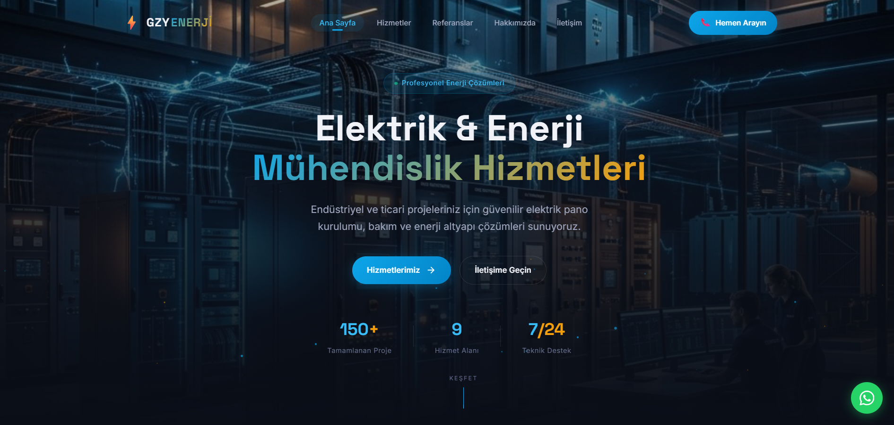
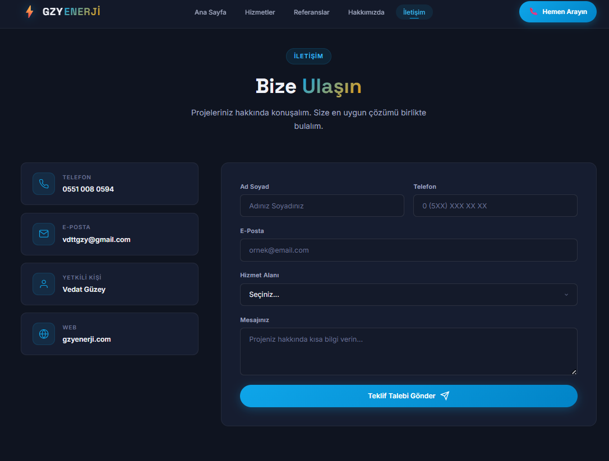
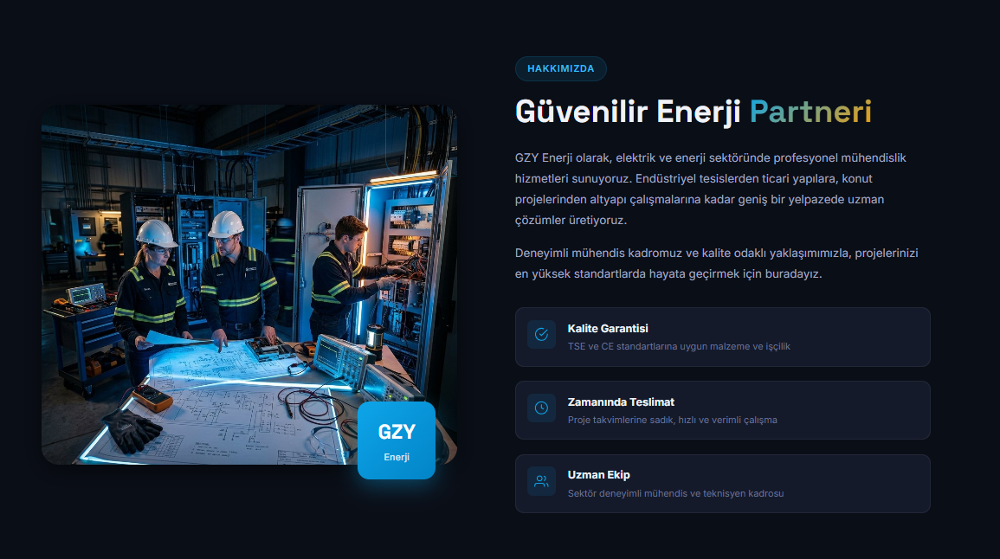
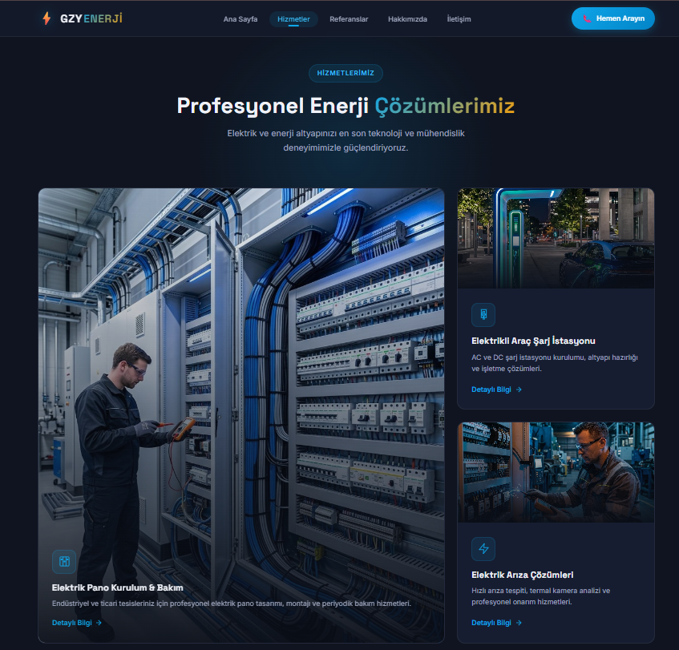
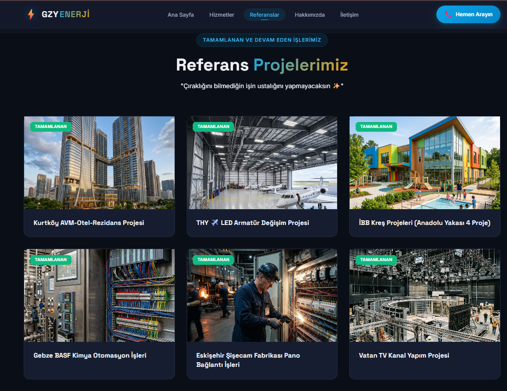
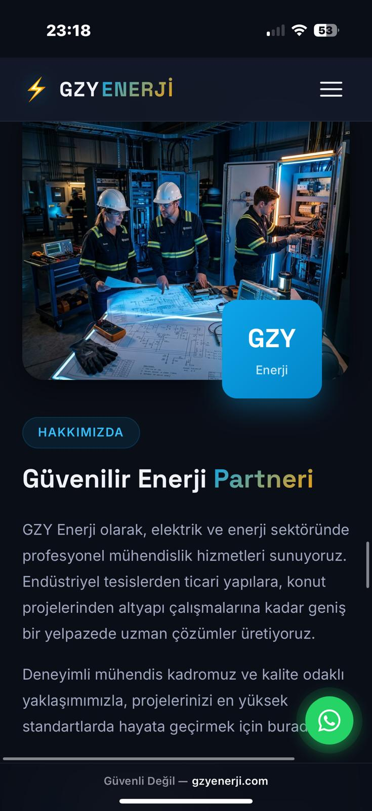
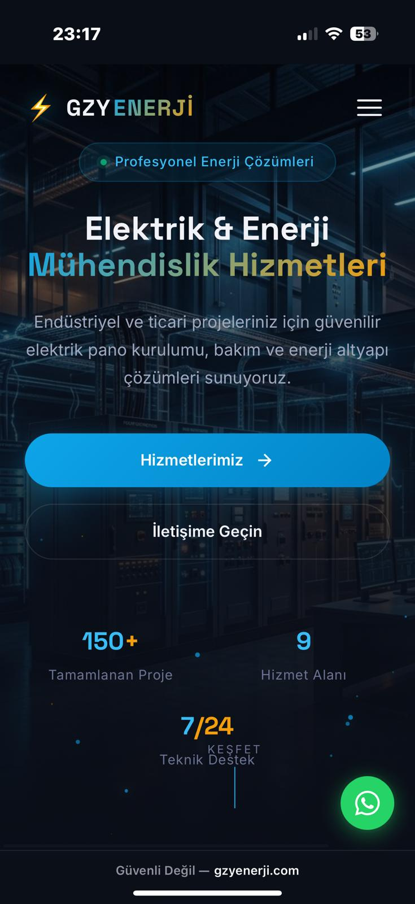
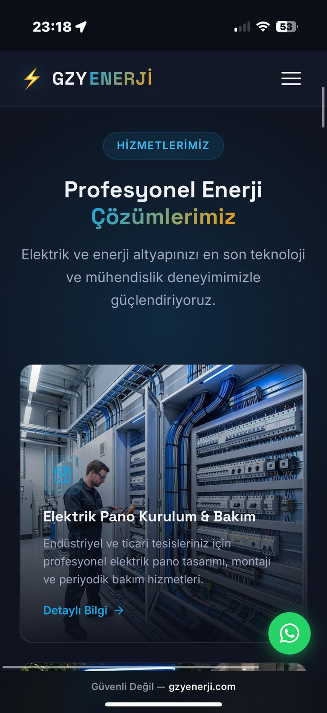
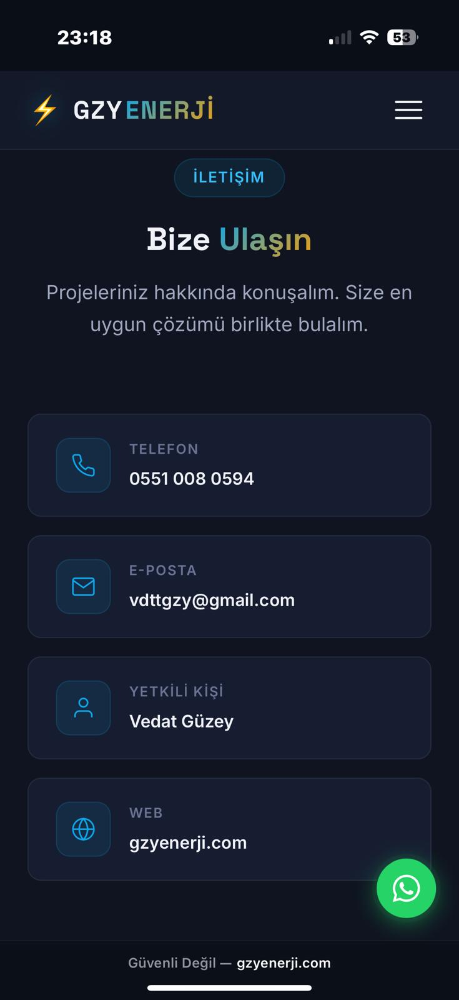

# ⚡ GZY Enerji - Kurumsal Web Sitesi

<div align="center">
  
</div>

<div align="center">
  
  
  
</div>

---

### 🌐 Canlı Önizleme
Projenin yayındaki haline aşağıdaki linkten ulaşabilirsiniz:
👉 **[gzyenerji.com](http://gzyenerji.com)**

---

## 📸 Ekran Görüntüleri

### Masaüstü Görünümü

<div align="center">
  
  
  <br>
  
  
</div>

### Mobil Görünüm

<div align="center">
  
  &nbsp;
  
  &nbsp;
  
  &nbsp;
  
</div>

---

## 📖 Proje Hakkında
**GZY Enerji**, modern mühendislik çözümlerini dijital dünyaya taşıyan, yüksek performanslı ve estetik odaklı bir kurumsal tanıtım sitesidir. Bu proje, sadece bir web sitesi değil; hız, SEO ve kullanıcı deneyiminin (UX) ön planda tutulduğu bir vitrin çalışmasıdır.

### ✨ Öne Çıkan Teknik Özellikler

| Özellik | Açıklama |
| :--- | :--- |
| 🚀 **Performans** | Vanilla JS ve optimize edilmiş görseller ile ışık hızında yükleme süreleri. |
| 📱 **Responsive** | Tüm mobil, tablet ve masaüstü cihazlar için %100 uyumlu tasarım. |
| 🔍 **SEO** | Semantik HTML5 yapısı ve SEO meta veri optimizasyonu. |
| 🎨 **Aesthetics** | Koyu mod teması, modern tipografi (Inter & Space Grotesk) ve cam (glassmorphism) efektleri. |
| ⚡ **Etkileşim** | Özel particle efektleri, dinamik rakam sayaçları ve akıcı scroll animasyonları. |

---

## 🛠️ Teknoloji Yığını (Tech Stack)

*   **Frontend:** HTML5, CSS3 (Modern Flexbox & Grid)
*   **Javascript:** ES6+ Vanilla JavaScript (Sıfır kütüphane bağımlılığı)
*   **Araçlar:** Python (Görsel optimizasyonu için), Git (Versiyon kontrolü)
*   **Entegrasyonlar:** WhatsApp API, Dinamik İletişim Formu

---

## 📂 Proje İçeriği ve Yapısı

```bash
├── 📁 images/           # Optimize edilmiş, yüksek kaliteli görseller
├── 📄 index.html        # Ana sayfa ve SEO konfigürasyonu
├── 📄 style.css         # Modern tasarım sistemi ve animasyonlar
├── 📄 script.js         # Modüler interaktif özellikler
└── 📄 README.md         # Proje dokümantasyonu
```

---

## 👤 İletişim
**Yazılım & Uygulama:** Görkem Çolak  
**Müşteri:** Vedat Güzey  
**Proje Adresi:** [gzyenerji.com](http://gzyenerji.com)  

---
<div align="center">
  <sub>© 2026 GZY Enerji Project. Bu proje modern web standartları ile geliştirilmiştir.</sub>
</div>
